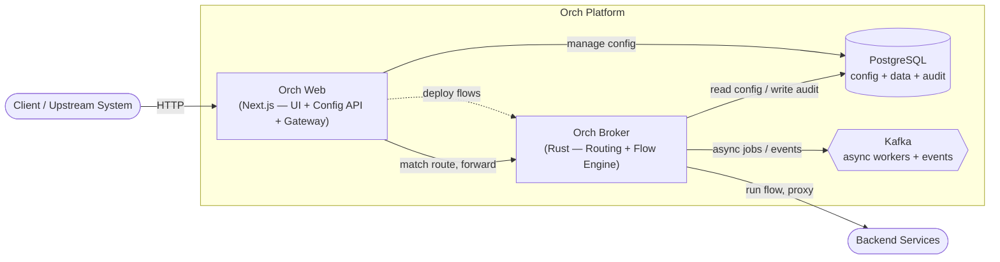
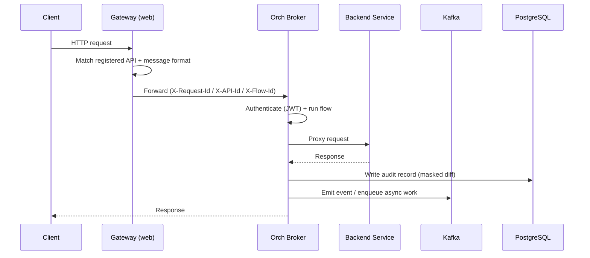

# Orch

[](LICENSE)
[](apps/orch-broker)
[](apps/web)

**Front your services with a programmable gateway — register APIs, build integration flows by dragging boxes, and audit every request down to the field. No glue code per integration.**

Orch is a self-hosted, config-driven API orchestration platform. A fast Rust broker routes traffic in front of your backends; a web UI is the control plane. Design pipelines visually, spin up instant CRUD APIs over real tables, encrypt sensitive columns, and keep an immutable, searchable audit trail — all from configuration.

> Use it as an API gateway, an integration hub, a backend-for-frontend, or an audit layer in front of legacy systems.

---

## Why Orch

- **Ship integrations as config, not code.** Register an API in the UI and it's routed, transformed, audited, and rate-limited — no new service to deploy.
- **One URL, many backends.** Route by request-body content, not just the path.
- **Audit that's actually useful.** Real before/after field diffs, masked and entity-tagged, exportable to Excel/CSV/PDF.
- **Resilient out of the box.** Circuit breaking, idempotency, quotas, rate limiting, and IP filtering ship with the Rust broker.

---

## Features

### 🔀 Smart API gateway
Three-level routing — registered API → project path-prefix → global fallback — with `:param` and `*` wildcard matching, positive/negative caching, and in-memory rate limiting. Multiple APIs can share one URL and be resolved by request-body discriminators.

### 🧩 Visual flow builder
Drag-and-drop pipelines (ReactFlow) built from a shared `@orch/sdk` node contract that the Rust engine executes. Sequential, parallel fork/join, and conditional routing, with **Fast** (in-memory sync), **Reliable** (Kafka-backed async), and **Custom** per-node execution strategies.

### 🗄️ Instant data APIs
Define a table in the **Data Repository** and get real PostgreSQL DDL, auto CRUD endpoints, and a generated **OpenAPI 3** spec immediately — optionally with encrypted columns.

### 📚 Data Catalog
Register and describe datasets (JSON schema, field mapping, hierarchy, ownership) so flows and audit logs can reference real business entities.

### 📜 Field-level audit trail
Write-only audit log with `{old, new}` field diffs, reference/transaction tagging, dataset attribution, real-user resolution, de-duplication, and configurable path-based masking applied before persistence. Search by time, user, IP, screen, or action; group by transaction; export Excel/CSV/PDF.

### 🔐 Column encryption
AES-256-GCM envelope encryption — a KEK wraps versioned data keys, with key rotation and lazy re-encryption. A database dump leaks only wrapped keys.

### 👀 Observability
Configurable event-log patterns, structured access logs, broker/DB/Kafka health monitoring, a Prometheus metrics endpoint, and configurable retention/purge for audit, logs, and events.

### 🔑 Auth & multi-tenancy
JWT login (bcrypt) with access/refresh tokens, SHA-256-hashed API keys with scopes and expiry, project-scoped isolation, and JWKS-based RS256 / shared-secret HS256 validation in the broker.

---

## Architecture



A request enters through the **gateway**, is matched against a registered API, and the **broker** runs the configured flow (extract → transform → proxy → audit), forwards it to the backend, and records an audit/event entry. The **web app** is the control plane for datasets, APIs, flows, and settings.

### Request lifecycle



---

## Quick Start

### Prerequisites
- Docker & Docker Compose
- (Optional, for host development) Node.js 20+, Rust 1.75+

### Run with Docker Compose

```bash
git clone https://github.com/EnterpriseX-Platform/Orch.git
cd Orch
docker compose up --build      # then open http://localhost:3047/orch
```

The stack builds from source and starts PostgreSQL, Zookeeper, Kafka, Kafka UI, a one-shot DB migration, the web app, and the broker.

| Service        | URL                          |
| -------------- | ---------------------------- |
| Orch Web (UI)  | http://localhost:3047/orch   |
| Orch Broker    | http://localhost:8047        |
| Kafka UI       | http://localhost:9048        |
| PostgreSQL     | localhost:5447               |

### Local development

```bash
pnpm install
pnpm start:infra                       # Postgres, Kafka, Zookeeper, Kafka UI

cd apps/web
npx prisma migrate deploy && npx prisma generate
pnpm --filter orch-web dev             # http://localhost:3047

cd apps/orch-broker
cargo run                              # http://localhost:8047
```

Copy [`.env.example`](.env.example) to `.env` and adjust. See [CONTRIBUTING.md](CONTRIBUTING.md) for details.

---

## Flow nodes

Pipelines are built from typed nodes (defined in `@orch/sdk`, executed by the Rust broker):

| Category | Nodes |
| --- | --- |
| **Triggers** | HTTP request, Webhook, Kafka consume, Schedule (cron) |
| **Extract** | Extract (body/header/query), JSONPath, XPath |
| **Transform / logic** | Transform (map/template), Script (sandboxed JavaScript), conditional routing |
| **Actions** | Proxy, HTTP call, Call service, Publish to queue, Database query |
| **Integration** | Audit, Event log, In-flow cache |
| **Output** | Response, Error, End |

> Scripting runs in a sandboxed JavaScript engine (QuickJS) with memory/stack limits.

---

## The gateway & config APIs

Client traffic flows through the gateway proxy at `/orch/api/v1/<your-path>`: requests are matched against registered APIs, the configured flow runs, and the result is proxied to the backend. Everything else — datasets, API registrations, flows, projects, audit configuration — is managed through the web UI (and its REST API under `/orch/api/...`).

---

## Tech stack

- **Web / control plane:** Next.js 16 (App Router), Prisma, PostgreSQL, TanStack Query, ReactFlow, Tailwind + MUI
- **Broker / engine:** Rust, Axum, Tokio, sqlx, rdkafka, QuickJS (`rquickjs`), `sxd-xpath`
- **Messaging:** Kafka (async workers + events)
- **Monorepo:** Turborepo + pnpm workspaces, shared `@orch/sdk`

## Project Layout

```
.
├── apps/
│   ├── web/            Next.js control plane (UI + config API + gateway)
│   └── orch-broker/    Rust gateway + flow engine
├── packages/
│   └── sdk/            Shared TypeScript SDK (@orch/sdk)
├── docs/               Architecture & design docs
└── docker-compose.yml  Local all-in-one stack
```

## Documentation

See [`docs/`](docs/) — [Architecture](docs/ARCHITECTURE.md), [Event-Driven Flow](docs/EVENT_DRIVEN_FLOW_ARCHITECTURE.md), [Config Concepts](docs/CONFIG_CONCEPT.md), [Logging Design](docs/LOGGING_DESIGN.md), and [External Workers](docs/external-workers-design.md).

## Contributing

Contributions are welcome! See [CONTRIBUTING.md](CONTRIBUTING.md) to set up a dev environment and submit changes, [CODE_OF_CONDUCT.md](CODE_OF_CONDUCT.md) for community guidelines, and [SECURITY.md](SECURITY.md) to report a vulnerability.

## License

Licensed under the [GNU AGPL-3.0](LICENSE).
